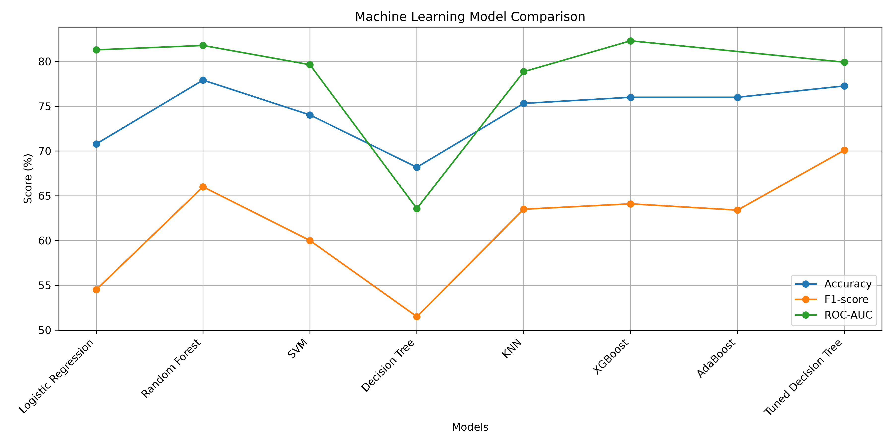
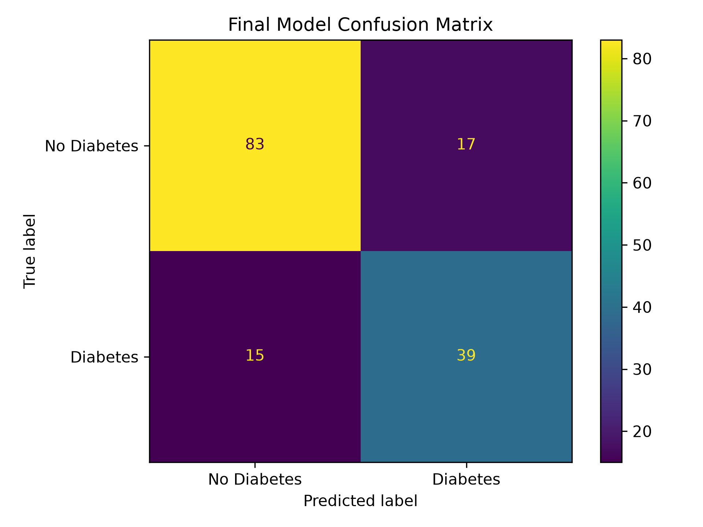
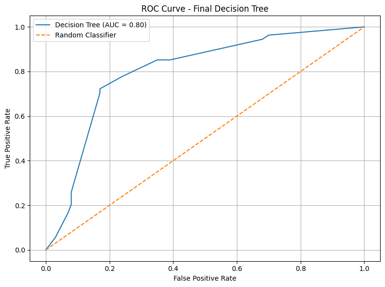

# Diabetes Prediction using Machine Learning

## Live Demo

Try the deployed diabetes prediction application:

[**Launch Diabetes Prediction App**](https://diabetesprediction-sbicr3bmwkusgq5erc7bkv.streamlit.app/)


A machine learning project that predicts the likelihood of diabetes using clinical health measurements. The project covers data preprocessing, model training, evaluation, hyperparameter tuning, and deployment through a Streamlit web application.

## Project Overview

This project develops a machine learning classification system for predicting diabetes from clinical health measurements. The dataset was preprocessed by handling invalid zero values and replacing them with appropriate median values. Multiple machine learning algorithms were trained and evaluated using different performance metrics, followed by hyperparameter tuning to improve the selected model. The final trained model was saved and integrated into a Streamlit web application for interactive predictions.

## Problem Statement

Diabetes is a common health condition that can be difficult to identify based only on individual clinical measurements. This project explores whether machine learning can learn patterns from patient health measurements and use those patterns to predict whether a patient belongs to the diabetes or non-diabetes class. The goal is to develop and evaluate a classification model as an educational machine learning application.

## Dataset

The project uses the Pima Indians Diabetes Dataset. It contains 768 patient records and 8 clinical input features. The target variable, `Outcome`, indicates whether diabetes is present (`1`) or not present (`0`).

### Features

| Feature | Description |
|---|---|
| Pregnancies | Number of pregnancies |
| Glucose | Plasma glucose concentration |
| BloodPressure | Diastolic blood pressure |
| SkinThickness | Triceps skin fold thickness |
| Insulin | 2-Hour serum insulin |
| BMI | Body Mass Index |
| DiabetesPedigreeFunction | Diabetes pedigree function |
| Age | Age of the patient |
| Outcome | Target variable: 0 = No diabetes, 1 = Diabetes |

## Data Preprocessing

The dataset was inspected for missing and invalid values before model training. In several clinical features, zero values were treated as missing values because zero is not a meaningful measurement for those variables. These values were replaced with `NaN` and then imputed using the median value of the corresponding feature. The data was then separated into input features (`X`) and the target variable (`y`), followed by a train-test split for model evaluation.

### Handling Invalid Values

Zero values were treated as missing values in the following features:

- Glucose
- BloodPressure
- SkinThickness
- Insulin
- BMI

Median imputation was then applied to replace the missing values.

### Median Values Used

| Feature | Median |
|---|---:|
| Glucose | 117 |
| BloodPressure | 72 |
| SkinThickness | 29 |
| Insulin | 125 |
| BMI | 32.3 |

### Train-Test Split

The dataset was divided into training and testing sets:

- Training set: 614 samples
- Testing set: 154 samples
- Input features: 8
- Target variable: `Outcome`

## Exploratory Data Analysis
Exploratory Data Analysis (EDA) was performed to understand the structure, distribution, and characteristics of the dataset before model training. The analysis included examining the dataset dimensions, target-class distribution, invalid zero values, and relationships between clinical features.

### Target Distribution

The target variable `Outcome` contains two classes:

| Outcome | Meaning | Samples | Percentage |
|---:|---|---:|---:|
| 0 | No diabetes | 500 | 65.10% |
| 1 | Diabetes | 268 | 34.90% |
| **Total** | | **768** | **100%** |

### Invalid Zero Values

The following zero values were identified during data inspection:

| Feature | Zero Values |
|---|---:|
| Pregnancies | 111 |
| Glucose | 5 |
| BloodPressure | 35 |
| SkinThickness | 227 |
| Insulin | 374 |
| BMI | 11 |
| DiabetesPedigreeFunction | 0 |
| Age | 0 |

## Machine Learning Models
Multiple machine learning classification algorithms were trained and evaluated to compare their performance on the diabetes prediction task. The models were selected to represent different approaches to classification, including linear models, distance-based methods, tree-based methods, ensemble learning, and support vector machines.

### Models Evaluated

| Model | Type |
|---|---|
| Logistic Regression | Linear classification |
| K-Nearest Neighbors (KNN) | Distance-based classification |
| Support Vector Machine (SVM) | Margin-based classification |
| Decision Tree | Tree-based classification |
| Random Forest | Ensemble of decision trees |
| AdaBoost | Boosting ensemble |
| XGBoost | Gradient boosting ensemble |

### Evaluation Metrics

The models were evaluated using multiple classification metrics:

- **Accuracy** — proportion of correctly classified samples.
- **Precision** — proportion of positive predictions that were actually positive.
- **Recall** — proportion of actual positive cases correctly identified.
- **F1-score** — harmonic mean of precision and recall.
- **ROC-AUC** — measures the model's ability to distinguish between the two classes across different classification thresholds.

## Model Performance & Comparison

Several machine learning models were evaluated using Accuracy, Precision, Recall, F1-score, and ROC-AUC.

| Model                         |   Accuracy |  Precision |     Recall |   F1-Score |    ROC-AUC |
| ----------------------------- | ---------: | ---------: | ---------: | ---------: | ---------: |
| Logistic Regression           |     70.78% |     60.00% |     50.00% |     54.50% |     81.30% |
| Random Forest                 |     77.92% |     71.70% |     61.10% |     66.00% |     81.79% |
| SVM                           |     74.03% |          — |          — |     60.00% |     79.64% |
| Decision Tree                 |     68.18% |          — |          — |     51.50% |     63.57% |
| KNN                           |     75.32% |          — |          — |     63.50% |     78.86% |
| XGBoost                       |     76.00% |     67.30% |     61.10% |     64.10% |     82.31% |
| AdaBoost                      |     76.00% |     68.10% |     59.30% |     63.40% |          — |
| **Final Tuned Decision Tree** | **79.22%** | **69.64%** | **72.22%** | **70.91%** | **80.06%** |

Because this is a medical prediction project, recall is an important metric to consider alongside accuracy. However, the model has not been independently clinically validated and should only be considered an educational machine learning demonstration.

### Final Model

A tuned **Decision Tree Classifier** was selected as the model used in the deployed application.

The final model was obtained using `GridSearchCV` with ROC-AUC as the optimization metric.

**Best Parameters:**

* `max_depth = 4`
* `min_samples_leaf = 10`
* `min_samples_split = 2`

**Test Set Performance:**

* Accuracy: **79.22%**
* Precision: **69.64%**
* Recall: **72.22%**
* F1-Score: **70.91%**
* ROC-AUC: **80.06%**

The confusion matrix on the test set was:

```text
[[83 17]
 [15 39]]
```

Because this is a medical prediction project, recall is an important metric to consider alongside accuracy. However, the model has not been independently clinically validated and should only be considered an educational machine learning demonstration.


## Visualizations

### Model Comparison

The following visualization compares the performance of the evaluated machine learning models using Accuracy, F1-score, and ROC-AUC.



### Final Model Confusion Matrix

The confusion matrix shows the classification results of the final Decision Tree model, including true positives, true negatives, false positives, and false negatives.



### ROC Curve

The ROC curve shows the ability of the final Decision Tree model to distinguish between the diabetes and non-diabetes classes across different classification thresholds.

The final model achieved a ROC-AUC of **0.8006** on the test set.




## Final Model

After comparing multiple machine learning models, a Decision Tree classifier was selected for the final application. Hyperparameter tuning was performed using `GridSearchCV` to find a suitable combination of tree parameters while evaluating the model using ROC-AUC.

### Hyperparameter Tuning

The best parameters obtained through `GridSearchCV` were:

| Parameter           | Value |
| ------------------- | ----: |
| `max_depth`         |     4 |
| `min_samples_leaf`  |    10 |
| `min_samples_split` |     2 |

The best cross-validation ROC-AUC score was approximately **0.7805**.

These parameters were used to train the final Decision Tree model.

### Final Test Performance

The final Decision Tree model achieved the following results on the test set:

| Metric    |  Score |
| --------- | -----: |
| Accuracy  | 79.22% |
| Precision | 69.64% |
| Recall    | 72.22% |
| F1-score  | 70.91% |
| ROC-AUC   | 80.06% |


### Confusion Matrix

The confusion matrix on the test set was:

|                        | Predicted No Diabetes | Predicted Diabetes |
| ---------------------- | --------------------: | -----------------: |
| **Actual No Diabetes** |                    83 |                 17 |
| **Actual Diabetes**    |                    15 |                 39 |

The model correctly classified **83 non-diabetes cases** and **39 diabetes cases**. It incorrectly classified **17 non-diabetes cases as diabetes** and **15 diabetes cases as non-diabetes**.

The confusion matrix provides a detailed view of the classification errors and helps distinguish between false positive and false negative predictions.


## Project Structure

```text
Diabetes_Prediction/
│
├── images/
│   ├── model_comparison.png
│   ├── confusion_matrix.png
│   └── roc_curve.png
│
├── models/
│   ├── diabetes_decision_tree.pkl
│   └── diabetes_medians.pkl
│
├── app.py
├── create_visualizations.py
├── requirements.txt
├── README.md
└── .gitignore
```

### File and Folder Description

| File / Folder              | Purpose                                                           |
| -------------------------- | ----------------------------------------------------------------- |
| `images/`                  | Contains model evaluation visualizations                          |
| `models/`                  | Contains the trained Decision Tree model and saved median values  |
| `app.py`                   | Streamlit application for interactive diabetes prediction         |
| `create_visualizations.py` | Script used to generate project visualizations                    |
| `requirements.txt`         | Lists the Python dependencies required to run the project         |
| `README.md`                | Project documentation                                             |
| `.gitignore`               | Specifies files and folders that should not be uploaded to GitHub |

## Technologies Used

* **Python** — Main programming language
* **Pandas** — Data loading, cleaning, and preprocessing
* **NumPy** — Numerical operations
* **Scikit-learn** — Machine learning models, preprocessing, evaluation, and hyperparameter tuning
* **Matplotlib** — Data visualization and model evaluation plots
* **Joblib** — Saving and loading the trained machine learning model
* **Streamlit** — Deployment and interactive web application
* **Git & GitHub** — Version control and project hosting


## Installation

### 1. Clone the Repository

```bash
git clone https://github.com/ahmadzubi2299/Diabetes_Prediction.git
cd Diabetes_Prediction
```

### 2. Create a Virtual Environment

```bash
python -m venv venv
```

### 3. Activate the Virtual Environment

**Windows:**

```bash
venv\Scripts\activate
```

**macOS / Linux:**

```bash
source venv/bin/activate
```

### 4. Install Dependencies

```bash
pip install -r requirements.txt
```


## Usage

### Run the Streamlit Application

After installing the required dependencies, start the application using:

```bash
streamlit run app.py
```

This will launch the Streamlit web application in your browser.

The application allows users to enter the required clinical measurements and receive a machine learning prediction for the diabetes class.


## Limitations

This project has several limitations that should be considered when interpreting the results:

* The dataset contains only **768 records**, which is relatively small for a machine learning application.
* The dataset has an imbalanced target distribution, with more non-diabetes cases than diabetes cases.
* Zero values in selected clinical features were treated as missing values and replaced using median imputation. This is a simplified preprocessing approach.
* Model performance was evaluated using a single train-test split, so the reported test results may vary with a different data split.
* The model was trained and evaluated on the Pima Indians Diabetes Dataset and was not externally validated on an independent clinical dataset.
* The application is intended for **educational and demonstration purposes** and should not be used as a medical diagnostic system.


## Future Improvements

The project can be extended and improved in several ways:

* Evaluate the model on an independent external dataset.
* Perform more robust cross-validation and model comparison.
* Explore probability threshold tuning to study the trade-off between precision and recall.
* Add model explainability techniques to better understand the factors contributing to predictions.
* Improve input validation and user interface design in the Streamlit application.
* Add automated testing for preprocessing and prediction functionality.
* Monitor model performance and retrain the model when new relevant data becomes available.
* Explore additional machine learning models and ensemble techniques.


## Disclaimer

This project is developed for **educational and demonstration purposes only**. The predictions generated by this application are based on a machine learning model trained on the Pima Indians Diabetes Dataset.

The application is not a medical diagnostic tool and should not be used to make medical decisions. Predictions should not replace evaluation, diagnosis, or advice from a qualified healthcare professional.

## Key Results

* Evaluated multiple machine learning classification algorithms for diabetes prediction.
* Applied preprocessing to handle invalid zero values in selected clinical features.
* Used median imputation for missing values created during preprocessing.
* Applied `GridSearchCV` to tune the Decision Tree hyperparameters.
* The final Decision Tree achieved **79.22% accuracy**, **72.22% recall**, **70.91% F1-score**, and **80.06% ROC-AUC** on the test set.
* Saved the trained model and preprocessing values using Joblib.
* Integrated the final model into a Streamlit web application for interactive predictions.


## Project Workflow

The project follows the following machine learning workflow:

1. **Data Collection** — Load the Pima Indians Diabetes Dataset.
2. **Data Inspection** — Examine the dataset structure, target distribution, and invalid values.
3. **Data Preprocessing** — Convert invalid zero values into missing values and replace them using median imputation.
4. **Train-Test Split** — Divide the dataset into training and testing sets.
5. **Model Training** — Train multiple machine learning classification models.
6. **Model Evaluation** — Compare models using Accuracy, Precision, Recall, F1-score, and ROC-AUC.
7. **Hyperparameter Tuning** — Use `GridSearchCV` to find suitable Decision Tree parameters.
8. **Final Model Selection** — Use the tuned Decision Tree as the model integrated into the application.
9. **Model Saving** — Save the trained model and preprocessing values using Joblib.
10. **Deployment** — Load the saved model in a Streamlit application and generate predictions from user-provided inputs.


## Saved Model Files

The trained model and preprocessing values are saved using Joblib so that the Streamlit application can load them without retraining the model.

| File                         | Purpose                                       |
| ---------------------------- | --------------------------------------------- |
| `diabetes_decision_tree.pkl` | Saved final Decision Tree model               |
| `diabetes_medians.pkl`       | Saved median values used during preprocessing |

The Streamlit application loads these files at runtime and uses them to process user input and generate predictions.


## Author

**Ahmad Aziz**

BS Artificial Intelligence Student
University of Agriculture Peshawar

GitHub: `maddo19`
LinkedIn: `ahmad-aziz-217742351`


